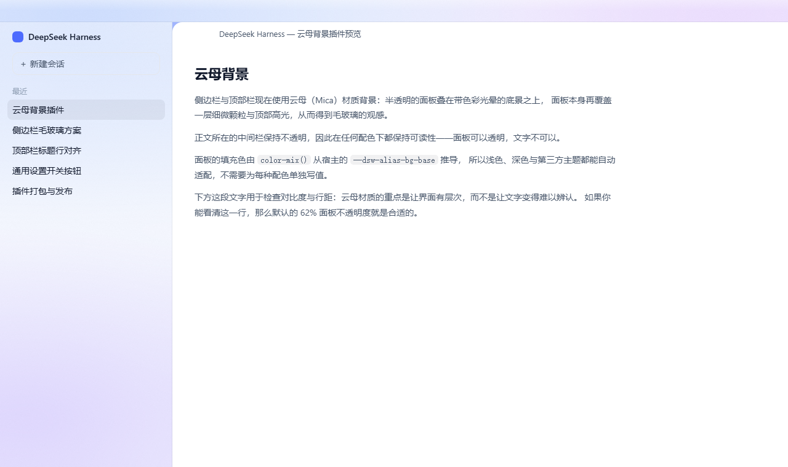
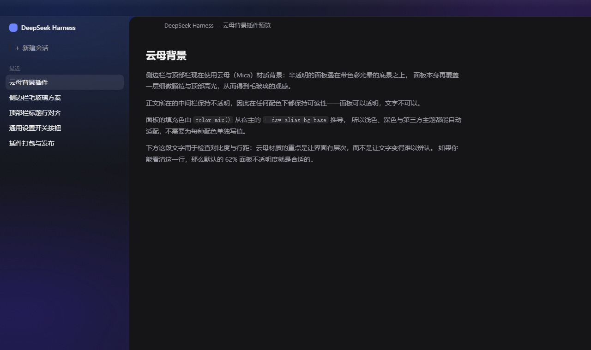

# dsh-ui-mica

Mica material for the DeepSeek Harness **sidebar** and **title row**, with an
on/off switch in **Settings → General**.





## What it does

The sidebar column and the Windows title row are two slices of one surface, and
the plugin paints them as such, stacked the way DWM stacks Mica: **the bottom
layer is a heavily blurred downsample of the current desktop wallpaper** — the
host half reads the wallpaper once in Node, scales it to 192×108 with `sharp`,
blurs it, and inlines the roughly 1.4 kB data URI into the stylesheet — with the
host's own surface colour laid over it, then a sheen and a fine grain. The
surface colour is derived from `--dsw-alias-bg-base`, so one wallpaper reads as a
pale tint in the light theme and a dark one in the dark theme without either
being written down anywhere.

When no wallpaper can be read — not Windows, no `sharp` in the profile, no such
file, or a file that will not decode — it falls back to a colour field painted in
place. The panels still work; only the colour stops being sampled. The stylesheet
opens with a comment saying which of the two you got, so it is one glance in
devtools.

Two surfaces, and only two. The content column, the app frame, `html`, `body` and
`#root` are all left exactly as the host drew them.

It also fixes the sidebar's collapse animation, which the host asks for and never
gets — see [The sidebar collapse animation](#the-sidebar-collapse-animation).

## Install

```sh
dsh plugin --profile <profile> add dsh-ui-mica
```

Restart the harness afterwards. A running `dsh web` composes its bundles at
startup, so the plugin is only picked up on the next launch.

## Settings

**Settings → General → Mica background** turns the material on and off. The
switch takes effect immediately: no reload, and no flicker in either direction.

A few cosmetic knobs are not in the UI. Set them in the profile's
`cordis.patch.yml` and reload the page:

```yaml
- insert:
    - id: ui-mica
      name: dsh-ui-mica
      config:
        enabled: true       # same switch as the Settings row
        opacity: 62         # 20–92: percent of the host surface colour kept in the panel
        wallpaper: true     # take the colour from the desktop wallpaper
        wallpaperPath: ""   # override where the wallpaper is read from; empty means detect
        tint: 100           # 0–200: strength of the fallback field, in percent
        noise: 0.06         # 0–0.3: opacity of the film grain
```

`opacity` is how much of the panel is the host's surface colour, so 62 leaves
roughly 38% of the wallpaper showing through. Raise it if text over the panels
ever feels low-contrast; lower it to make more of the wallpaper visible. `tint`
only affects the fallback path, and `wallpaperPath` points at another image
instead — for macOS, for Linux, or just to try a different wallpaper.

## How it works

The plugin has two halves, and only one of them owns the CSS.

**`lib/index.js` — the host half.** It declares the six `volatile()` config
fields, suppresses the schema-generated settings page (the browser half draws
its own row), and hooks `webserver/index-inject` to push two entries into every
served `index.html`:

- one `<style>` with the whole material, and
- one `<script>` that sets `data-dsh-mica` on `<html>` before the first paint.

That second entry is why there is no flash of unstyled chrome: the browser half
loads well after the first frame, and an attribute that arrives late would show
as a visible jump.

**`lib/client.js` — the browser half.** It reads the `ui-mica` settings
namespace through `configForms`, mirrors `enabled` onto the document element,
and registers the Settings row. It ships no CSS of its own.

**Every selector is gated on `html[data-dsh-mica="on"]`.** That is the load
bearing property of the design: the switch is a single attribute flip, the
stylesheet is injected exactly once per page, and the off state cannot leave a
half-applied material behind.

Six smaller decisions worth knowing about:

- The wallpaper is sampled **on the host half**, and deliberately not on the
  render path. `webserver/index-inject` is synchronous and cannot wait for an
  image decode, so the first index render gets the fallback field, the sample
  lands a moment later, and the next page load gets the wallpaper. Re-sampling is
  driven by the file's `mtime` and size rather than a timer, so an unchanged
  wallpaper costs one `stat` per render and nothing else. The sampling parameters
  were measured rather than guessed — 192×108, lanczos3, blur 6, WebP q80 comes
  out at 1028 bytes with no JPEG blocking visible at 6.5× — and the downscale
  comes first on purpose: the source is a 1920×1200 JPEG, and shrinking it is
  what averages the 8×8 compression blocks away.
- The panel fill is derived, not hard-coded:
  `color-mix(in srgb, var(--dsw-alias-bg-base) <opacity>%, transparent)`. It
  therefore follows the active theme — light, dark, or any third-party theme —
  without a per-scheme table to keep in sync.
- The sidebar's inner root paints `--dsw-specific-sidebar-fill` a second time, on
  top of the column, and that fill is opaque. The plugin clears the token on the
  column so the sidebar collapses back to one painted layer; the title row has no
  such child, and without this the two panes would disagree. Clearing the token
  rather than neutralising the elements that read it is deliberate — the inner
  root is a grandchild of the column, so no child combinator reaches it, and
  `[class*="_root"]` also matches unrelated elements all over the sidebar.
  Inheritance needs no selector and cannot be wrong about depth.
- The colour field is `background-attachment: fixed`. The title row and the
  sidebar column are 36px and ~700px tall, so a percentage-sized gradient
  resolves to a different shape in each and the two panes visibly disagree at the
  seam. Anchoring both boxes to one viewport-sized field removes the seam and
  keeps a single grain phase across it.
- The material wins against the theme presenter by `!important`. The presenter
  writes its tokens as inline custom properties on `<body>`, which is exactly
  what a stylesheet can override; nothing here depends on the host agreeing to
  lower its own specificity.
- **The two panes have no edge line.** Windows already sets `border-right: none`
  on the sidebar column and the title row never had a border, so the only lines
  at those surfaces were hairlines 0.2.0 drew itself; 0.2.1 removed them. In a
  plain browser tab the host does draw a `.5px` border, and the plugin clears its
  *colour* rather than dropping the border: keeping the half-pixel box means
  switching the material off shifts nothing.

## The sidebar collapse animation

The sidebar snapping shut in one frame is a bug in the host, and this plugin is
where it gets fixed.

The host means to glide: its stylesheet carries
`.BynINW_frame[data-animating]{transition:grid-template-columns …}`, and it sets
`data-animating` from a layout effect that runs *after* React has committed the
new column width. A layout read in between forces the style recalculation, so the
declaration lands one recalculation too late and the transition never runs.
Measured against the real thing: the column crossed its whole range in **8 ms**,
with `transitionrun` never firing at all.

No stylesheet can arm that from the far side of the commit — every plausible
selector (`[data-animating]`, `[data-sidebar-collapsed]`) flips in the same
commit as the width. So the browser half arms it from *before* the commit: a
capture-phase `click` listener on `document` runs ahead of the handler React
attaches at the root, and marks the frame with `data-dsh-mica-collapse`. By the
time the width changes, the transition is already live. The mark expires 700 ms
later, well after the 460 ms transition and after the host's own 600 ms settle
timer.

Two details are load-bearing:

- **It is scoped to the toggle, not to the grid.** A blanket transition on
  `grid-template-columns` would also animate the right-hand panel's track during
  an ordinary window resize, which reads as lag. With the right panel closed the
  plugin also arms the transition from `[data-rightbar-collapsed]`, which is the
  state the host itself has already committed to — and in that state no track
  depends on the viewport, so resizing still changes nothing.
- **The transition is repeated as `none` for `[data-dragging]` and under
  `prefers-reduced-motion`.** The first because the drag handle has to keep up
  with the pointer; the second at the *same specificity* as the rule it defeats,
  since a plain `[data-animating]{transition:none}` would lose to it.

Verified on the real shell: the column now walks 280 → 279 → 263 → 234 → 157 →
109 → 60 → 19 → 1 → 0 over 460 ms and back, `transitionrun` fires in both
directions, and with the material switched off the frame is back to the host's
untouched `transition-property: all` with no transition events at all.

## What the material deliberately does not do

Both of these shipped as bugs in 0.1.0 and are now pinned by assertions in
`scripts/smoke.mjs`.

- **No `backdrop-filter`, `filter`, `transform`, `contain`, `will-change` or
  `perspective` anywhere.** Each of those makes an element a containing block for
  `position: fixed` descendants. The sidebar toggle is the only fixed element in
  the shell, so putting `backdrop-filter` on the sidebar column dragged it out of
  the title row and down onto the brand logo. Mica does not blur what is behind
  the pane either, so nothing is lost by leaving these out.
- **No rule repaints `html`, `body`, `#root`, the app frame or the content
  column.** 0.1.0 made `body` transparent and drew a full-viewport backdrop,
  which tinted the conversation area. A translucent panel is a decoration; a
  translucent wall of text is a bug.

## Known limitations

- **No title row in a plain browser document.** The harness only sets
  `data-windows-titlebar` in the Windows desktop shell; a browser tab has no
  title row to paint, so only the sidebar changes there. This is the host's
  layout, not a gap in the plugin.
- **The knobs outside the UI need a page reload.** They are read when the index
  is served, so editing the YAML changes the next page load, not the current one.
- **The material assumes the host keeps its `--dsw-*` tokens.** It layers on top
  of the theme rather than replacing it; a host that renames those tokens would
  leave the panels unpainted rather than broken.
- **This is a simulation of Mica, not Mica.** The colour is now genuinely taken
  from your wallpaper, but the compositing still happens in the renderer. The real
  thing is composited by DWM and can only be switched on from the Electron main
  process with `new BrowserWindow({ backgroundMaterial: "mica" })`, out of reach
  of a renderer-side plugin. The host knows the way — its welcome window asks for
  `backgroundMaterial: "acrylic"` on win32, while the main window only sets an
  opaque `titleBarOverlay` colour. Part of why this does not look more like Mica
  is therefore an application-level choice, not the plugin's.
- **Windows is the only wallpaper source.** It reads the flattened copy Windows
  keeps at `%APPDATA%\Microsoft\Windows\Themes\TranscodedWallpaper`. macOS records
  the wallpaper in a binary plist and this plugin does not parse it; anywhere else,
  point `wallpaperPath` at an image and it works the same.
- **It needs a `sharp` that is already in the profile.** The plugin does not
  declare it as a dependency — pulling a native module into a profile to make a
  one-kilobyte thumbnail would be rude — only as an optional peer, resolved at
  runtime. The harness ships one, so this is rarely a concern; without it the
  material falls back silently.

- **The collapse glide depends on a class name in the host.** Arming it reads
  `[class*="_toggle"]` and `[class*="_frame"]`, the same kind of dependency the
  material already has on `[class*="_sidebarCol"]`. If a future host renames
  them the glide stops being armed and the sidebar returns to snapping — nothing
  breaks, and nothing else is affected.
- **A collapse route that is neither the toggle nor the right panel closed still
  snaps.** Those two states are the only ones that are already true before the
  width changes, which is the one thing a transition needs. In practice the
  toggle is the only control that moves the sidebar; a keyboard shortcut pressed
  while the right panel is open falls back to the host's own behaviour.

## Development

There is no build step. Both halves ship as hand-written JavaScript, so the
scripts below stand in for the compile-and-check stage a TSX plugin would have.

```sh
node scripts/check.mjs   # static bundle invariants (the "build" that isn't)
node scripts/smoke.mjs   # runs both halves against a stubbed host
```

`smoke.mjs` asserts behaviour and the CSS invariants above. Neither script can
tell you what the material *looks* like, and that limit is worth stating plainly:
0.1.0 passed both suites while looking wrong on screen, because the suites model
the host rather than being the host. Anything about the rendered result — pane
colours, the seam between the two surfaces, whether a control has moved — has to
be checked against a real harness instance, by reading computed styles out of the
running page. In particular:

- the title row and the sidebar must measure the same colour where they meet;
- the sidebar toggle must sit at the same coordinates with the material on as
  with it off;
- an on/off diff of every element in the document must name only the sidebar.

## License

MIT — see [LICENSE](LICENSE).
